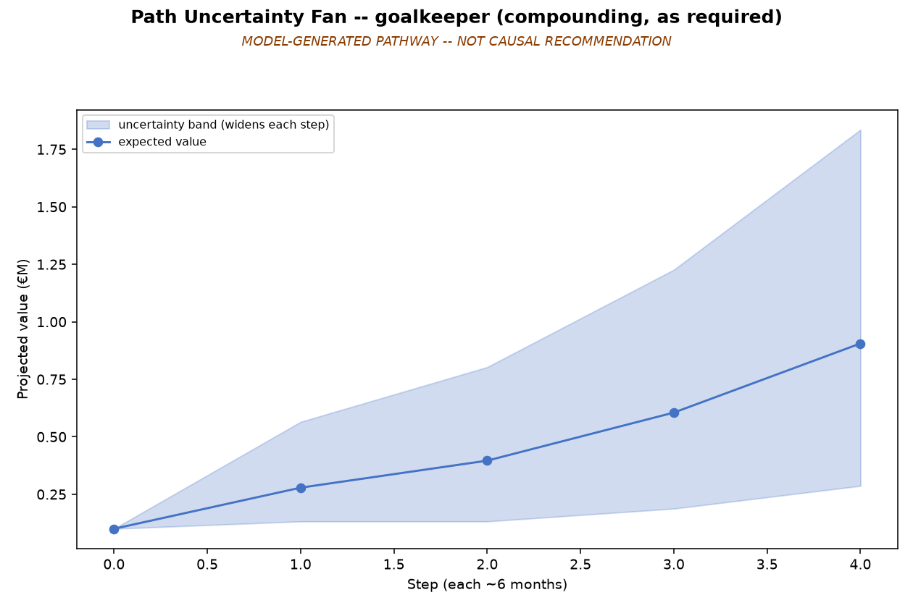
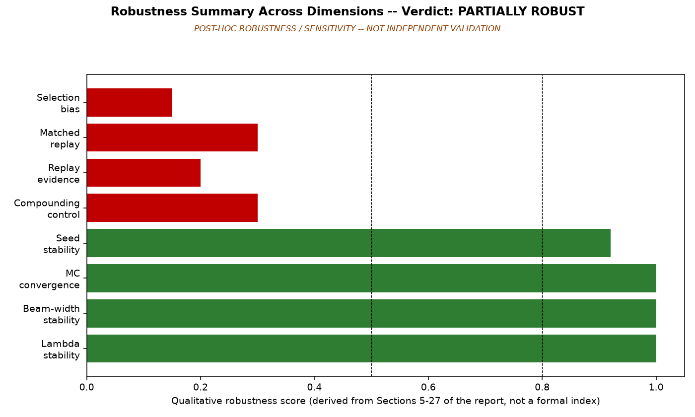

# From Forecast to Pathway: AI-Based Market-Value Scenario Analysis for La Liga Player Development

**Soccer**\
**Paper ID:** To be assigned

> **Publication status:** the research release is public, but data redistribution, complete
> authorship, and blind-review treatment still require confirmation before Sloan submission. Raw
> and row-level data are not included. See `PUBLIC_RELEASE_AUDIT.md`.

## Abstract

Football clubs making transfer, retention, and academy decisions need to think beyond what a
player is worth today. A single forecast is useful, but it says little about the different routes
a player might plausibly follow or when uncertainty has become too large for that forecast to be
trusted. We therefore test two linked questions: whether information available at a given decision
date can predict a player's six-month market-value growth on genuinely unseen data, and whether
that frozen forecast can support transparent multi-step scenarios without treating development
milestones as causes of future value.

We assembled **8,433 valuation events for 1,132 La Liga players** from July 2022 to June 2025,
joining valuation history with age, position, completed-prior-season performance, role, team
strength, and milestone states. Every feature is computed strictly as of the decision date. The
data are split chronologically into TRAIN through December 2023, VALIDATION through June 2024,
and an untouched TEST period through June 2025. Ridge, Extra Trees, Gradient Boosting, and
HistGradientBoosting were compared; the final six-month engine is a frozen
`HistGradientBoostingRegressor`.

The target is the six-month log market-value return:

`ln(first qualifying observed market value at least six months later / current market value)`

In football terms, the model starts with the player's value on the decision date and predicts the
proportional change to the first eligible valuation snapshot at least six months later. This is an
observed market-value forecast, not a transfer-fee forecast.

Once frozen, the model feeds a beam-search scenario engine over **18 eligible milestones**. Each
step carries residual-quantile uncertainty, an evidence tier, an actionability label, and relevant
warning flags. Club change is excluded from the scenario menu. The engine produces model-generated
what-if pathways, not causal recommendations or guaranteed futures.



*Figure 1. Uncertainty widens step by step across a model-generated development pathway; the
scenario is not a causal recommendation.*

The six-month model generalizes on held-out TEST data: **n = 1,345 valuation events, MAE = 0.3094,
Spearman rho = 0.5916**. It matched or improved on VALIDATION (**n = 1,188, MAE = 0.3390,
Spearman rho = 0.5688**). MAE measures the typical absolute miss on the log-return scale; lower is
better. Spearman correlation measures whether higher-growth and lower-growth events are ranked in
roughly the correct order; higher is better. The 12-month TEST evaluation remains **inconclusive**
because only **10 finite labels** are available.

Scenario search is stable at the first decision under the main parameter sweeps: isolated tests on
32 events found 100% agreement for uncertainty penalty lambda ≥ 0.20 and beam width ≥ 5. A broader
five-variant audit is a different experiment: 12 of 16 events (75%) were stable and four were
partially stable. These results are complementary and must not be merged into one percentage.

The pathway layer also reveals why restraint matters. Historical replay produced mean lift of
about **−0.143 across 150 cases**. Matched replay was negative or worse for **9 of 11 milestones**,
while milestone-attainment AUCs of **0.86–1.00 for 9 of 11 milestones** exposed strong selection
bias. The pathway layer is therefore **partially robust**: parameter stability and convergence are
strong, but replay and selection-bias evidence block causal interpretation.

Stress testing found a low-value compounding failure in which a €25,000 player reached a 425×
scenario. A historically derived cumulative cap reduced it to **55.25×**. None of six known stress
cases exceeded its own ceiling. No path in a 20-case normal-value audit met the study's
material-distortion rule, although two first steps changed.



*Figure 2. Robustness is mixed: strong first-step stability and convergence, but replay and
selection-bias diagnostics block causal interpretation. The chart is a qualitative summary, not a
formal statistical index.*

For sporting directors, recruitment teams, and academy staff, the contribution is a leakage-safe
forecasting layer turned into uncertainty-labelled what-if pathways. It can help compare plausible
development routes and reveal where evidence becomes weak. It cannot establish that making a
player reach a milestone will cause the forecasted value growth.

**This paper was developed in collaboration with SoccerSolver.**

**Open-source repository:**
[MITSloanProblem13-player-value-maximization-pathways](https://github.com/RupayanHalder39/MITSloanProblem13-player-value-maximization-pathways)

## Reproduction

Python 3.12 was used for release testing.

```bash
python -m venv .venv
source .venv/bin/activate
python -m pip install -r requirements.txt
python scripts/verify_release.py
```

The final command checks the published cohort, held-out metrics, robustness distinction, and
safety-cap values against the included aggregate tables. Full model retraining is not possible
from this repository because the source rows and frozen model binaries are withheld pending a
data-rights decision. Reproducibility is therefore **partial**, not full. See `data/README.md` and
`docs/methodology.md`.

## Limitations

The study covers one league over a short 2022–2025 period, so performance in other competitions is
unknown. Market values are observational estimates rather than realized transfer fees. Team
context has incomplete coverage, and performance features summarize the last completed season
rather than current match-level form. The 12-month TEST sample is too small for a conclusion.
Historical replay is negative, matching retains material imbalance, and uncertainty compounds
across longer paths. The €100 million marker is an illustrative scenario destination, not a
calibrated probability that a player will reach that value.

---

## Researcher

<p align="left">
  
</p>

### Rupayan Halder

**PhD Student**<br>
Jadavpur University, Kolkata

**Football AI Researcher**

**Assistant Professor**<br>
University of Engineering & Management (UEM), Kolkata

**Research Collaborator**<br>
SoccerSolver

**Former Software Engineer — Platform Engineering**<br>
Session AI

Rupayan's research interests focus on applying artificial intelligence, machine learning, data
analytics, and computational methods to real-world problems in football, including player
performance analysis, recruitment, transfer-market decision-making, and sporting strategy.

### Connect

[GitHub](https://github.com/RupayanHalder39) ·
[LinkedIn](https://www.linkedin.com/in/rupayan-halder-962922209/) ·
[Email](mailto:rupayanhalder313239@gmail.com)

---

## Research Collaboration

<p align="left">
  
</p>

**This research was developed in collaboration with SoccerSolver.**

---

## Citation

Rupayan Halder is a confirmed researcher/author of this project. The complete author list is still
being finalized; no claim of sole authorship is made. Use the metadata in `CITATION.cff`, and
resolve the remaining authorship placeholder before submission.

## Licence

The repository software is provided under the MIT License. This does not grant rights to the
underlying private or third-party data, names, marks, photographs, or other provider content. Data
access and redistribution remain subject to separate authorization; see `PUBLIC_RELEASE_AUDIT.md`.
