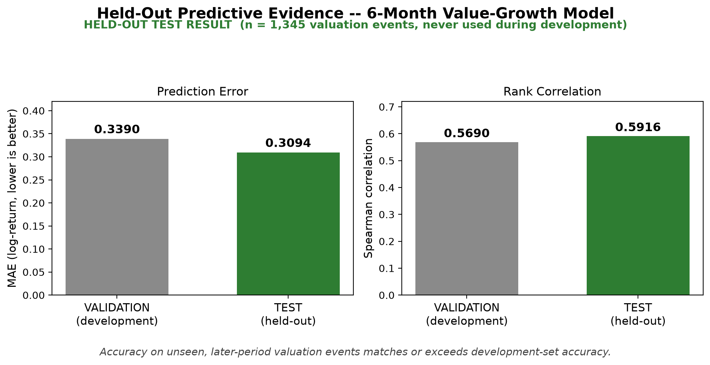
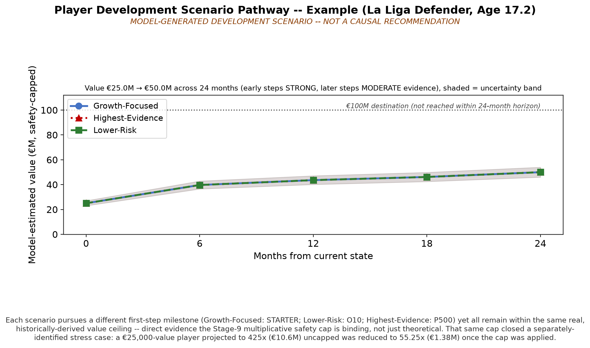

# Player Development Scenario Pathways: Forecasting Six-Month Market-Value Evolution in La Liga

**Track:** Soccer
**Paper ID:** [To be assigned]

**Authors:** [PLACEHOLDER — human confirmation required. A candidate roster exists on this team's
sibling "Research Project 2026/2027" submissions (Problem 2, Problem 10), but was never explicitly
confirmed for this specific paper. Do not submit without confirming.]

**Open-source repository:** [PLACEHOLDER — public GitHub URL to be added before submission, per
the mandatory SSAC open-source requirement. No repository currently exists for this project.]

---

## Introduction

Football clubs need to consider where a player's market value may move next when making transfer,
retention, and academy decisions. A point estimate alone gives decision-makers little basis for
judging uncertainty or evidence strength. We ask whether a player's current state can predict
near-term value growth with independently held-out skill, and whether that forecast can support
multi-step development scenarios toward an elite valuation such as €100M without implying a
guarantee.

## Methods

We constructed a longitudinal La Liga dataset of 1,132 players and 8,433 valuation events
(2022-2025), with leakage-safe features computed at each decision point and a chronological
TRAIN/VALIDATION/TEST split. TEST was opened once. Models selected against non-learned baselines
predict 6-month and 12-month log market-value return from valuation momentum, prior-season
performance, milestone indicators, and team context. A beam-search engine composes the frozen 6-month model into three labeled
development scenarios (Growth-Focused, Lower-Risk, Highest-Evidence) over performance milestones,
explicitly excluding club-change as a recommendation and attaching uncertainty and evidence-tier
metadata to every step. We stress-tested this pathway layer across parameter, horizon, and
off-policy replay dimensions, then closed a compounding failure with a historically-derived
multiplicative safety cap.

## Results

The strongest independent result is the 6-month model on held-out TEST: n=1,345 valuation events, MAE=0.3094,
Spearman=0.5916, matching or improving on its own development-set accuracy (VALIDATION MAE=0.339,
Spearman=0.569).

**Figure 1.** Held-out predictive evidence: the 6-month model's error and rank correlation on
1,345 never-before-seen TEST valuation events, alongside its own VALIDATION accuracy.

The companion 12-month evaluation is INCONCLUSIVE DUE TO n=10 finite TEST labels and is reported
only for completeness, never as a pass or fail, though it had cleared VALIDATION baselines before
TEST was opened. The pathway layer is classified PARTIALLY ROBUST: first-step scenario
recommendations were stable for 12 of 16 events (75%) in the broader five-variant audit; separately,
isolated lambda and beam-width sweeps reached 100% agreement in their stable ranges. Off-policy historical replay remains
negative (mean lift approximately −0.14, n=150), and matched replay stays negative or worsens for 9 of
11 milestones, and milestone attainment shows strong selection-bias evidence (AUC up to 1.00) — so
the tool is framed strictly as scenario exploration, never causal recommendation. The safety cap
closed a concrete stress case, reducing a €25,000-value player's projected 24-month multiplier
from an unrealistic 425x to a historically-grounded 55.25x, with zero of six known stress cases
exceeding their own locked ceiling. No path in a twenty-case normal-value audit met the study's
material-distortion rule, although two first steps changed.

**Figure 2.** A worked development-scenario example (La Liga defender, age 17.2): three
milestone-distinct scenarios bounded by the same safety cap that closed the stress case above.

## Conclusion

The practical contribution is a decision-support tool where clubs compare Growth-Focused,
Lower-Risk, and Highest-Evidence development scenarios for a given player, each carrying attached
uncertainty, evidence strength, and disclosed warnings when historical evidence disagrees — never
a single unexplained number, and never a "best" path. €100M appears only as a scenario destination
for illustrating distance-to-target, not as a calibrated real-world probability. The central
limitation is that scenario replay remains negative off-policy and milestone attainment is
confounded by pre-existing player state, so outputs describe historically-supported possibilities
rather than validated causal guidance for what a player should do next; broader, multi-league
validation is a natural extension.

---

**Keywords:** football analytics; market-value forecasting; player development; machine learning;
scenario analysis; sports analytics; held-out evaluation

This paper was developed in collaboration with SoccerSolver.

**Word count (title + abstract body, per SSAC rule):** 490 / 500 words.
**Figures used:** 2 / 2 maximum.
